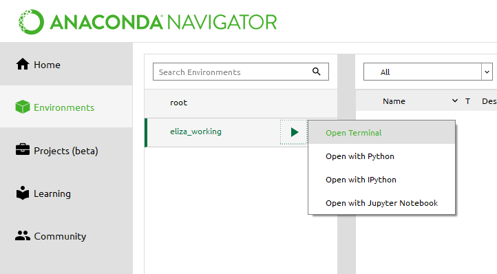

# BanorteAsistenteFinanciero

## INDICE

- **[Resumen ejecutivo](#resumen-ejecutivo)**
- **[Prototipo funcional](#prototipo-funcional)**
- **[Reporte técnico](#reporte-técnico)**

## Resumen ejecutivo

<div style="text-align : justify">

**Visión General del Proyecto:**

Desarrollo de un Asistente de Inversiones Integrado con Tecnologías Avanzadas

**Descripción del Reto:**

El desafío consiste en desarrollar un Asistente de Inversiones para los clientes de Banorte, el banco fuerte de México; mediante la combinación de tecnologías de vanguardia, incluyendo la inteligencia artificial mediante la API de chat GPT, la plataforma Streamlit para la interfaz de usuario, GitHub para el control de versiones, Google Cloud para el almacenamiento y gestión de datos mediante SQL, y la integración de las diversas opciones de fondos de inversión ofrecidos por Banorte.

**Objetivos del Proyecto:**

• Asesoramiento Personalizado: Crear un asistente que ofrezca asesoramiento personalizado en inversiones, considerando el perfil y las necesidades financieras de cada cliente de Banorte.

• Educación Financiera: Facilitar la educación financiera de los clientes proporcionando información detallada sobre las opciones de inversión y los principios fundamentales de las finanzas.

• Automatización Inteligente: Aplicar la inteligencia artificial para automatizar análisis de datos, seguimiento de inversiones y decisiones, mejorando la eficiencia y precisión del asesoramiento.

• Interfaz Amigable: Diseñar una interfaz de usuario intuitiva y atractiva con Streamlit para que los clientes puedan interactuar de manera sencilla con el asistente.

**Productos de inversión considerados:**

• Integra las diferentes opciones de fondos de inversión de Banorte, incluyendo Banorte CETE, Banorte Digital, Banorte Plazo, Banorte Dólares, Banorte Dólares+ y Banorte Fondo Estrategia NTED, de modo que los clientes puedan explorar y seleccionar los productos que mejor se adapten a sus necesidades.

**Audiencia objetivo:**

Mercado objetivo: Nuestro mercado se enfoca a los cuentahabientes del banco banorte que busquen asesoramiento financiero en inversiones.

## Prototipo funcional

---

### Instalacion

Cree una nueva carpeta, ejecute

```bash
   git clone https://github.com/Johann-28/BanorteAsistenteFinanciero.git
```

Instala Streamlit en Windows
El administrador de entorno oficialmente respaldado por Streamlit en Windows es Anaconda Navigator.

Instala Anaconda
Si aún no tienes instalado Anaconda, sigue los pasos proporcionados en la página de instalación de Anaconda.

Crea un nuevo entorno con Streamlit
A continuación, deberás configurar tu entorno.

Sigue los pasos proporcionados por Anaconda para configurar y gestionar tu entorno utilizando Anaconda Navigator.

Selecciona el icono "▶" junto a tu nuevo entorno. Luego selecciona "Abrir terminal":



En la terminal, ubiquese en la carpeta del repositorio y escriba:

```bash
   pip install streamlit
```

```bash
  pip install openai
```

```bash
  streamlit run chatbot.py
```


[Presentacion canva](https://www.canva.com/design/DAFvWreSng8/g4egi1Rrm9cMWEkNdTfkSA/view?utm_content=DAFvWreSng8&utm_campaign=designshare&utm_medium=link&utm_source=editor)

## Reporte técnico

---

### Arquitectura

**Tecnologías Clave:**

• Inteligencia Artificial: La API de chat GPT se utilizará para proporcionar respuestas y recomendaciones basadas en el procesamiento de lenguaje natural y el análisis de datos históricos.

• Streamlit: Se emplea para desarrollar la interfaz de usuario interactiva y visual del asistente, permitiendo a los usuarios interactuar con facilidad.

• GitHub: Se utilizará para el control de versiones y la colaboración en equipo, garantizando una gestión eficiente del código y la documentación del proyecto.

• Google Cloud (SQL): Se aprovechará para almacenar y gestionar los datos de los clientes y las inversiones de manera segura y escalable.

</div>
